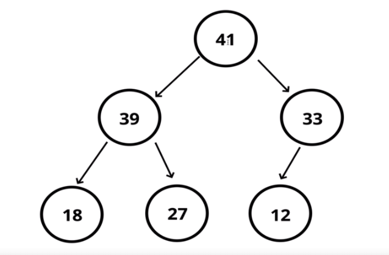
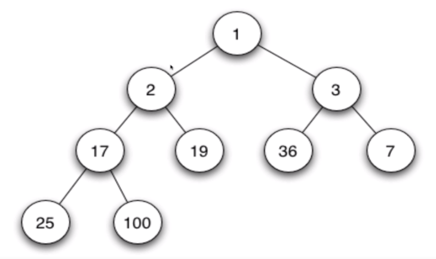
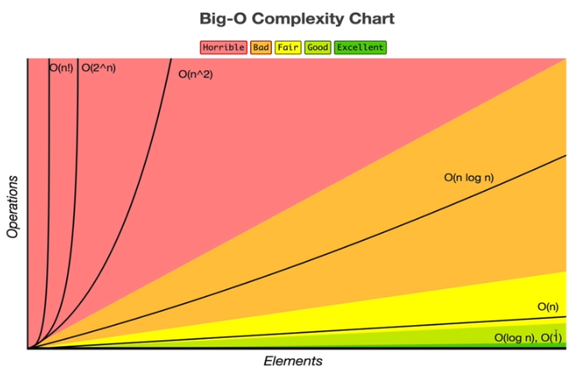

<!-- markdownlint-disable MD033 -->
# **Binary Heaps**

Binary heaps are very similar to binary search trees, except they have some different rules. In a *max* binary heap, the parent node is always larger than the child nodes. In a *min* binary heap, the parent nodes are always smaller than the child nodes. Binary heaps can also have a maximum of 2 nodes as children, much like binary search trees.

## **Max Binary Heap**

- Each parent has at most two child nodes.
- The value of each parent node is **always greater** than its child nodes.
- There are no implied ordering between sibling nodes. Just because a node is to the left of another sibling, it doesn't mean its smaller, and vice versa.
- A binary heap is as compact as possible. All of the children of each node are as full as they can be.
- Left children are always filled out first, before the right node.

## **Min Binary Heap**

- Each parent has at most two child nodes.
- The value of each parent is **always smaller** than its child nodes.
- There are no implied ordering between sibling nodes. Just because a node is to the left of another sibling, it doesn't mean its smaller, and vice versa.
- A binary heap is as compact as possible. All of the children of each node are as full as they can be.
- Left children are always filled out first, before the right node.

### **Creating a Binary Heap with an Array**

A binary heap can be represented using an array, as it can be fully functional as a binary heap so long as we have the correct methods for insertion in the BinaryHeap class.

### **Finding a Child Node from Parent's Index**

To find the child nodes from a parent there is a need to do a small bit of maths. If we had an index of $n$, the left child is at index $2n + 1$, whilst the right child is at index $2n + 2$. So if were looking for the children of the index of 6, the left child would be at the index of 13, and the right child would be at the index of 14.

### **Finding the Parent Node from a Child's Index**

To find the parent node from a specific child nodes index there is also a need to do a bit of a maths. For any child node at index of n, its parent node is at index $(n - 1) / 2$ . `Math.floor()` should also be used to remove the decimal (if it exists), because you cannot have an index with a decimal value. So if we were looking at the child node at an index of 13, then we would subtract 1 and divide it by 2, so the parent would be the index of 6.

## **Insertion**

Insertion into a max binary heap can be done by pushing the value to the end of the array, and then "bubbling up" the binary heap until it reaches its correct spot. The "bubbling up" is simply checking whether the current parent node is larger than itself - if it is, then the value should be swapped with the parent; if it's not then it should stay where it is. If it is a min binary heap, then the opposite would be true - it would only be swapped if the parent is smaller than the current node.

## **Big O of Binary Heaps**

| Method                  | Time Complexity   |
| ----------------------- | ----------------- |
| Insertion / `enqueue()` | $O$ $($$log$ $N)$ |
| Removal / `dequeue()`   | $O($$log$ $N)$    |
| Searching               | $O(N)$            |

Insertion and removal for binary heaps are incredibly fast as far as Big O goes. $O$ $($$log$ $N)$ is one of the best possibly time complexities, as this graph shows. Insertion and deletion is $O$ $($$log$ $N)$ because it takes a maximum of the logarithm of $N$ to insert or remove the element. A logarithm is the quantity representing the power to which a fixed number must be raised to produce a given number. For example, if there was a heap with 16 elements, it would take a maximum of 4 computations to find the element, as 4 is the base 2 logarithm of 16.

Searching has a time complexity of $O$ $(N)$ because there is no specific way to find a particular element when all of the siblings from a single parent have no specific order to them. Therefore to try and find one specific value, the amount of elements in the binary heap ($N$) directly affects the amount of computations to find that element, because it could be anywhere in the binary heap. The only information that can be used to compute where the value is is that the parent is always equal or smaller than its children in a min binary heap, and that the parent is equal to or larger in a max binary heap.

