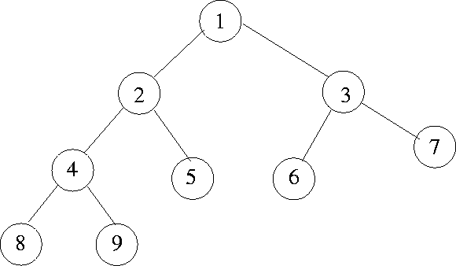
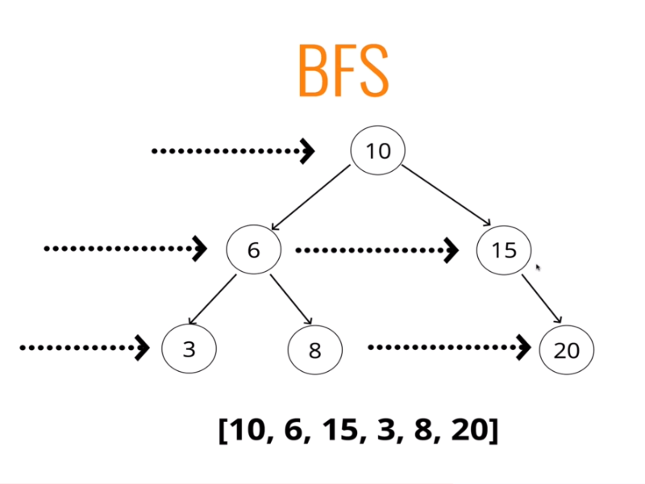

<!-- markdownlint-disable MD033 -->

# **Trees**

A tree is a non-linear data structure that consists of nodes that are in
a parent child-relationship. They contain branches that can contain other
nodes from one main root node. Nodes cannot reference sibling or parent
elements, they can only reference children.

## **Terminology**

**ROOT** - The root is the top elements in a tree

**CHILD** - A child is the node directly connected to another node when moving away from the root.

**PARENT** - The parent is the node connected above the current node in a tree.

**SIBLING** - Siblings are a group of nodes with the same parent.

**LEAF** - A leaf is a node with no children
  
**EDGE** - The connection between one node and another.

## **Uses in Programming**

Trees are used in a variety of ways in programming, in ways like parsing the
HTML DOM (Document Object Model), network routing, abstract syntax trees,
artificial intelligence, folders within a computer file system, and JSON.

## **Tree Variants**

### **Binary Trees**

Binary trees are special type of tree where they can have a maximum of two
children, so you can only have zero, one or two children from one parent.

### **Binary Search Trees**

Binary search trees are a special type of a binary tree. It has the same
functionality of a binary tree where a parent can only have 0-2 children,
but the nodes are sorted, meaning that the node to the left of a parent is
always **less** than the parent, and the node to right is always **more**
than the parent. The data is mainly numeric, however you can compare
any data type as long as they can be compared to one another.

## **Tree Traversal**

Tree traversal is a method of looking at every node in any type of tree at least one time. There are so many different methods of traversing a tree, but there are two main strategies behind all of these methods - breadth-first search and depth-first search. The difference between the two are the general direction on how you do the search.

## **Breadth-First Search**

Breadth-first searching is where you start from the the root node, then going to a different "row" and check all nodes, then repeating on all of the "rows" until the whole tree have been checked.

## **Depth-first Search**

Depth-first searching is where you are going down vertically through the tree, and moving along "columns" and check all of those nodes, then repeating the process until all of the "columns" have been checked and all of the nodes have been visited. There are three different orders within depth-first searching - pre order, post order, and in order.

### **Pre Order**

Pre order is a depth-first searching technique where you visit the node first, then traverse through the left and the right nodes of that current node recursively. Essentially you push the node into a visited array *before* you traverse through other nodes. The root node will always be the first node in this array, and we would add each of its children (left then right) after.

## **Post Order**

Post order is a depth-first searching technique which is similar as pre order, except you push the nodes to the visited array *after* the all of a node has it's children visited. The root node will always be the last node added to the visited array.

## **In Order**

In order is is similar to both of the other depth-first searching techniques, except in order returns a sorted visited array (if the tree is a binary-search tree). In order traverses through all of the left nodes before pushing them to the visited array, the right nodes are then traversed, and pushed to the visited array.

## **Breadth-First Search or Depth-First Search**

### **Time Complexity**

The time complexity for breadth-first searching and depth-first searching is exactly the same, because we always have to visit the same amount of nodes one time, and we never have to visit the same element more than one time. The time complexity for both is $O(n + m)$, where $n$ is the number of vertices, and $m$ is the number of edges in the tree.

### **Space Complexity**

The space complexity for the tree depends on which technique you use. Some techniques fair much better in certain techniques than others do:

If you have a tree which is a lot wider than it is tall, where you have lots of nodes in the same "row", depth-first searching is a good way to traverse through all these nodes in the quickest possible time. The reason for this is that with breadth-first searching we would have to add a lot of nodes into the queue before they can be processed and set into the visited array. The more nodes in the queue, the more space in memory will be needed.

If there is a tree that has very little left or right nodes, and it is a deeper format(lots of parent to child edges), it would be better to use breadth-first searching. The reason for this is that with depth-first searching we would have to keep adding the recursive traverse method to the call stack, while not actually doing anything (or doing very little) with those methods until the bottom node is found.
