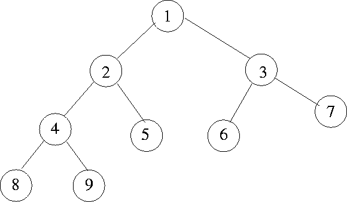

# **Trees**

A tree is a non-linear data structure that consists of nodes that are in
a parent child-relationship. They contain branches that can contain other
nodes from one main root node. Nodes cannot reference sibling or parent
elements, they can only reference children.

## **Terminology**

**ROOT** - The root is the top elements in a tree

**CHILD** - A child is the node directly connected to another node when moving away from the root.

**PARENT** - The parent is the node connected above the current node in a tree.

**SIBLING** - Siblings are a group of nodes with the same parent.

**LEAF** - A leaf is a node with no children
  
**EDGE** - The connection between one node and another.

## **Uses in Programming**

Trees are used in a variety of ways in programming, in ways like parsing the
HTML DOM (Document Object Model), network routing, abstract syntax trees,
artificial intelligence, folders within a computer file system, and JSON.

## **Tree Variants**

### **Binary Trees**

Binary trees are special type of tree where they can have a maximum of two
children, so you can only have zero, one or two children from one parent.

### **Binary Search Trees**

Binary search trees are a special type of a binary trees. It has the same
functionality of a binary tree where a parent can only have 0-2 children,
but the nodes are sorted, meaning that the node to the left of a parent is
always **less** than the parent, and the node to right is always **more**
than the parent. The data is mainly numeric, however you can compare
any data type as long as they can be compared to one another.

